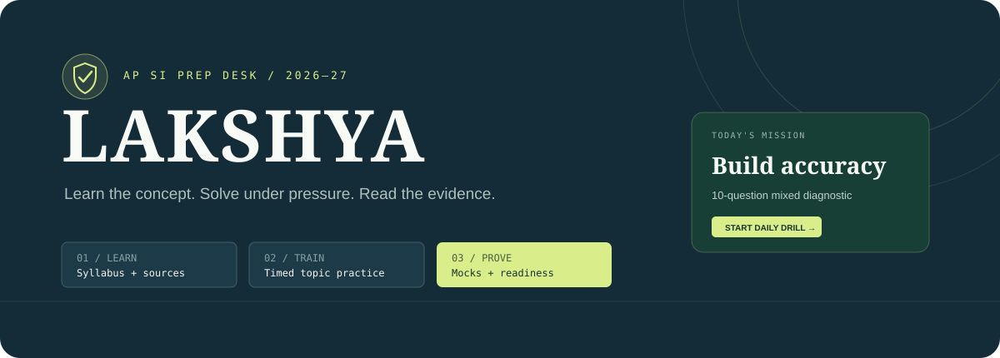

<div align="center">
  
</div>

<p align="center">
  <a href="https://lakshya-ap-si-prep.vercel.app"><strong>Open the live preparation desk →</strong></a>
</p>

# Lakshya · AP SI Prep Desk

A focused, local-first preparation workspace for the Andhra Pradesh Police Sub Inspector examination. Lakshya turns the official syllabus into a daily workflow: learn a concept, solve timed questions, review errors, and measure readiness.

## What is inside

- Official 2026 exam profile with direct SLPRB notification access
- Concept maps and trusted source links for every major syllabus area
- Original practice questions with hints, worked explanations, difficulty, and target time
- AP paper source library with provenance labels
- Other-state official SI paper sources for topic-wise training
- 313 unique original questions across all five subject groups
- 50 deterministic mock-test blueprints: 40 sectionals and 10 full 100-question simulations
- Full-screen timer, question palette, answer state, hints, and review flags
- Daily activity, streak, accuracy, subject diagnosis, and category-aware readiness
- Browser persistence plus JSON export/import for backups

## Current content status

The current release contains 313 reviewed, original questions. Every full mock draws 100 unique items without repetition inside that attempt, and each numbered mock remains reproducible on retry. Questions may reappear across different numbered mocks so performance can be compared against a stable editorial bank.

Lakshya does not claim a complete 20–25 year official AP SI archive because one could not be verified. The archive distinguishes official board sources, verified mirrors, and material that still needs review. Commercial books such as R.S. Aggarwal are linked as references and are not copied.

## Run locally

```bash
npm install
npm run dev
```

Production checks:

```bash
npm run lint
npm run build
```

## Storage and future sync

Progress is stored in `localStorage` under `apsi-command:v1`. Use **Profile → Export JSON** for a portable backup. When Supabase environment variables are present, email magic-link or Google login automatically syncs the same state into an RLS-protected per-user row. Run [`supabase/migrations/001_user_state.sql`](supabase/migrations/001_user_state.sql) in the project SQL editor before enabling cloud sync.

## Source policy

The current exam profile links to the [official APSLPRB 2026 notification](https://slprb.ap.gov.in/2026_PDFS/SLPRB_AP_SI_Notification_2026.pdf). Foundation resources link to NCERT, the Legislative Department, RBI, NDMA, AP Government, and other primary sources. Every imported paper should carry its exam, year, state, source URL, verification status, and rights status.

## Technology

React 19 · TypeScript · Vite · Lucide · CSS · Vercel

---

This is an independent preparation tool and is not affiliated with APSLPRB. Candidates should rely on the official board notice for recruitment rules and amendments.
